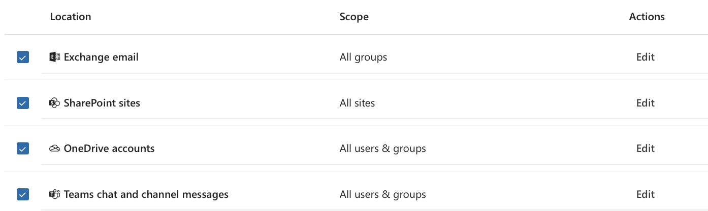
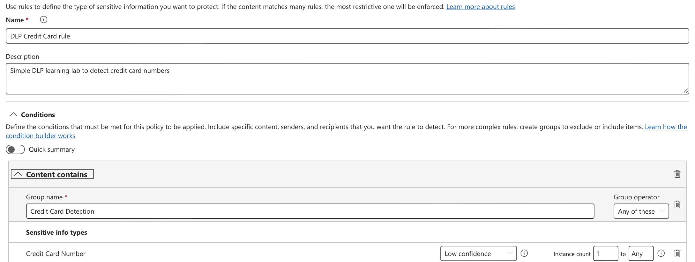
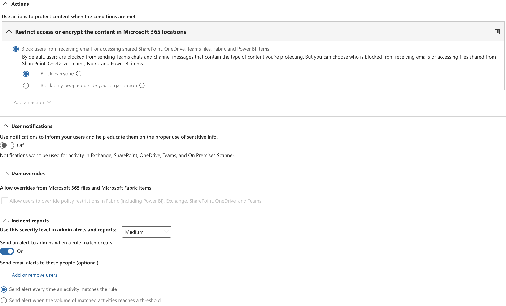
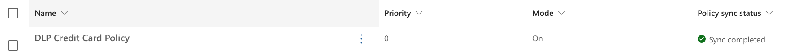

# DLP in Microsoft Sharepoint, Ondrive for Business and Teams

## Description
> [VaySec](https://vaysec.com) is a Cybersecurity firm in Melbourne, Australia. VaySec employees uses Microsoft 365 for communication, emails , storing documents and files and Entra ID for securing identity and access for users, devices and applications.
---
VaySec wants to prevent data leaks happening unintentionally or otherwise when communicating within or outside the organisation. A VaySec consultant has been tasked to configure and test ***Data Loss Prevention policy*** in Purview. 
The purpose of this lab is to test Microsoft Purview Data Loss Prevention (DLP) with Microsoft Teams.
The test demonstrates that Purview can:
- Detect a Credit Card Number in a Teams message.
- Apply a DLP rule.
- Block the Teams message.
- Record the DLP activity in Activity Explorer.
- Generate a DLP alert for the administrator.

**Expected flow**
Teams message → Sensitive information detected → DLP rule matched → Message blocked → Activity recorded → Alert generated

## Pre-requisites
Before starting the test, make sure you have:

- Microsoft 365 E5 license.
- Access to the Microsoft Purview portal.
- Permission to create/manage DLP policies.
- Permission to view DLP Alerts and Activity Explorer.
- Microsoft Teams available to the test user.
- A test user covered by the DLP policy.
- Preferably, a second test account for a 1:1 Teams chat.

Teams location
The DLP policy must include:
Teams chat and channel messages – All accounts

## Step by Step guide

### Step 1: Create a DLP Policy
Open:
- Microsoft Purview → Data Loss Prevention → Policies 
   Create policy
- You will get the template/category screen.
  Choose something similar to:
   Custom → Custom policy → Then Next.
- Give it a  name such as:
   **DLP Credit Card policy**
- Set Description as *Creating a custom policy to check sensitive information like Credit card.*
- Assign admin units (Leave the default value)
- Select the Location you want the rule to apply

- Leave all default values and move to creating DLP rule as below

### Step 2: Create a DLP rule for the policy

- Microsoft Purview → Data Loss Prevention → Policies → DLP CC policy test
- Create rule **DLP Credit Card rule**
- For the condition, select:
  Content contains
  Then:
    Sensitive info types
  Select:
    Credit Card Number
So your condition should effectively be:
Content contains → Sensitive info types → Credit Card Number

- Set the Actions as below
  - Block everyone from receiving message.
  - Send an alert to admins when a rule match occurs.

*This is a standard Microsoft sensitive information type. Microsoft also uses Credit Card Number as the example for endpoint DLP testing*

**Note:** Once all steps are completed, you can either run the Policy in simulation mode or turn on.
If the policy initially shows *Sync in progress* allow the policy time to synchronize before testing. Thois may take 1-2 hours or more.

You can follow the below steps once the policy has status *On* and Sync *Completed*

### Step 3: Perform the Teams Test
